# Automated Network Reconnaissance using Nmap and Bash

A beginner-friendly tool for automating network scanning tasks using Nmap and Bash scripting.

## Overview

This project aims to help beginners understand how cybersecurity professionals gather information about computer networks and identify potential vulnerabilities. It automates various Nmap scans through a simple Bash script.

## Features

- Performs multiple types of network scans with a single command:
  - Ping scan to check if hosts are up
  - Basic port scan to find common open ports
  - Full port scan (all 65535 ports)
  - OS detection and service version identification
  - Optional vulnerability scanning
- Saves all scan results into organized files with timestamps
- Beginner-friendly interface with clear instructions
- Checks for dependencies before running

## Requirements

### For Linux/Unix Systems (Recommended)
- Linux/Unix-based operating system (Ubuntu, Debian, Kali Linux recommended)
- Nmap installed on your system
- Bash shell
- Root/sudo privileges (for certain scan types)

### For Windows Systems
- Windows 10/11 with one of the following:
  - Windows Subsystem for Linux (WSL) installed
  - Git Bash
  - Cygwin with Bash and Nmap packages
- Nmap for Windows installed (https://nmap.org/download.html)

## Installation

### Kali Linux Installation (Recommended for Security Testing)

Kali Linux is an ideal platform for this tool as it comes with Nmap pre-installed and is designed for security testing.

1. If using Kali Linux in a VM (VMware, VirtualBox, etc.):
   - Make sure your network adapter is set to NAT or Bridged mode to access network targets
   - You may need to adjust VM settings to enable promiscuous mode for certain scan types

2. Clone this repository:
   ```
   git clone https://github.com/AashishChauhan0207/Automated-Network-Reconnaissance-using-Nmap-and-Bash.git
   cd Automated-Network-Reconnaissance-using-Nmap-and-Bash
   ```

3. Make the script executable:
   ```
   chmod +x scan.sh
   ```

4. You're ready to run the tool! Nmap is already pre-installed on Kali Linux.

### Other Linux/Unix Installation

1. Clone this repository:
   ```
   git clone https://github.com/AashishChauhan0207/Automated-Network-Reconnaissance-using-Nmap-and-Bash.git
   cd Automated-Network-Reconnaissance-using-Nmap-and-Bash
   ```

2. Make the script executable:
   ```
   chmod +x scan.sh
   ```

3. Install Nmap if you don't have it already:
   ```
   # For Debian/Ubuntu based systems
   sudo apt update
   sudo apt install nmap

   # For RHEL/CentOS/Fedora
   sudo yum install nmap
   ```

### Windows Installation

1. Install Nmap for Windows from the official website: https://nmap.org/download.html
   - Make sure to add Nmap to your system PATH during installation

2. Choose one of these options:
   
   **Option 1: Using Windows Subsystem for Linux (WSL)**
   - Install WSL following Microsoft's instructions
   - Install a Linux distribution (Ubuntu recommended)
   - Open WSL terminal and follow the Linux installation steps above

   **Option 2: Using Git Bash**
   - Install Git Bash from https://gitforwindows.org/
   - Clone the repository and navigate to it:
     ```
     git clone https://github.com/AashishChauhan0207/Automated-Network-Reconnaissance-using-Nmap-and-Bash.git
     cd Automated-Network-Reconnaissance-using-Nmap-and-Bash
     ```
   - Run the script with Git Bash

   **Option 3: Using Cygwin**
   - Install Cygwin with Bash and Nmap packages
   - Clone the repository and run through Cygwin terminal

## Usage

### Running on Kali Linux

1. Navigate to the Automated-Network-Reconnaissance-using-Nmap-and-Bash directory:
   ```
   cd Automated-Network-Reconnaissance-using-Nmap-and-Bash
   ```

2. Run the script:
   ```
   ./scan.sh
   ```

3. Enter the target IP address or domain when prompted.

4. The script will perform various scans and display the progress.

5. Results will be saved in the `results` directory with a filename format of `target_timestamp_scan.txt`.

6. For comprehensive scans (like vulnerability scanning), run with sudo privileges:
   ```
   sudo ./scan.sh
   ```

### Running on Other Linux/Unix Systems

1. Navigate to the Automated-Network-Reconnaissance-using-Nmap-and-Bash directory:
   ```
   cd Automated-Network-Reconnaissance-using-Nmap-and-Bash
   ```

2. Run the script:
   ```
   ./scan.sh
   ```

3. Enter the target IP address or domain when prompted.

4. The script will perform various scans and display the progress.

5. Results will be saved in the `results` directory with a filename format of `target_timestamp_scan.txt`.

### Running on Windows

**Using WSL:**
1. Open WSL terminal
2. Navigate to the project directory 
3. Run `./scan.sh`

**Using Git Bash:**
1. Open Git Bash
2. Navigate to the project directory
3. Run `./scan.sh`

**Using Cygwin:**
1. Open Cygwin terminal
2. Navigate to the project directory
3. Run `./scan.sh`

**Important Windows Notes:**
- Make sure Nmap is in your PATH or modify the script to point to the Nmap installation
- You may need to run your terminal with Administrator privileges for certain scans
- Some advanced Nmap features might not work as expected on Windows

## Step-by-Step Demonstration

Below is a step-by-step demonstration of how to use the tool in Kali Linux.

### 1. Opening the Terminal

First, open a terminal in Kali Linux:

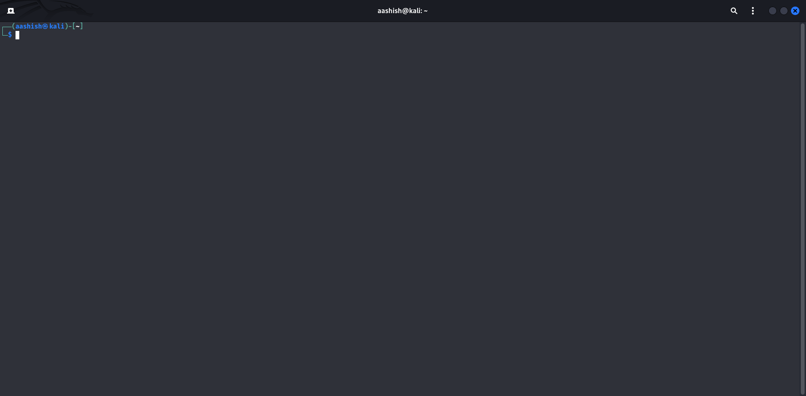

### 2. Navigating to the Project Directory

Navigate to the directory where you've saved the project:

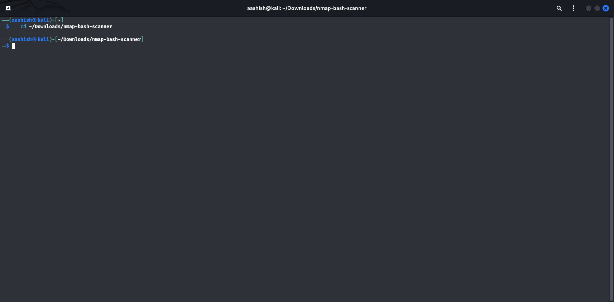

### 3. Making the Script Executable

Make the script executable using the chmod command:

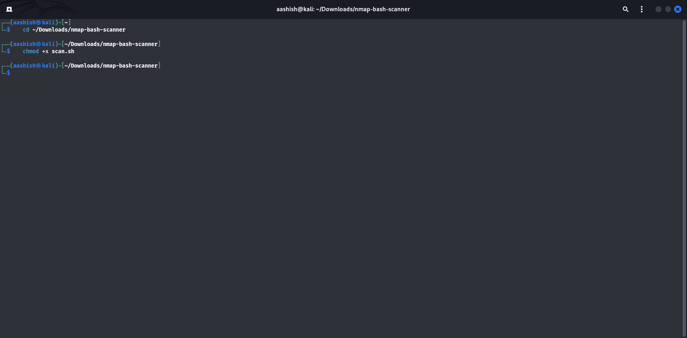

### 4. Running the Script

Execute the script and see the welcome banner:

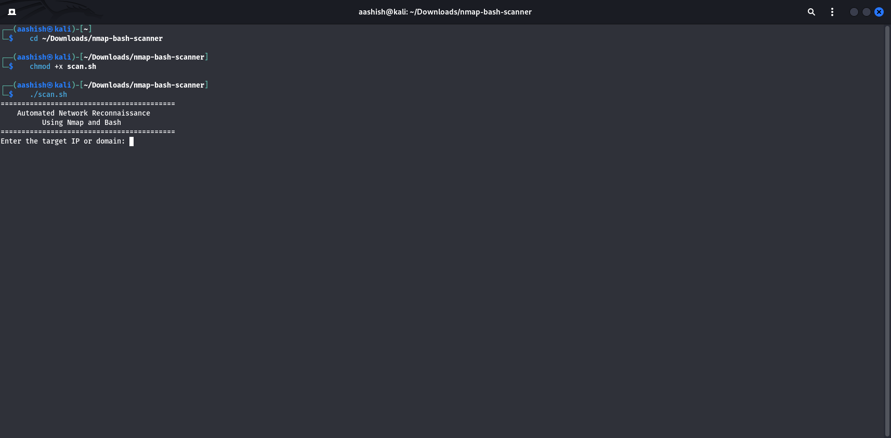

### 5. Scanning in Progress

The script performs multiple types of scans, showing progress for each:

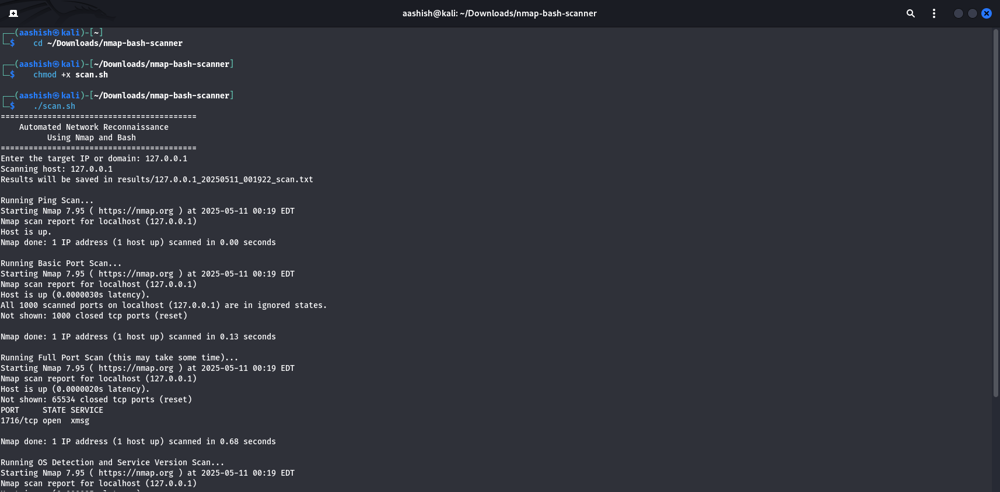

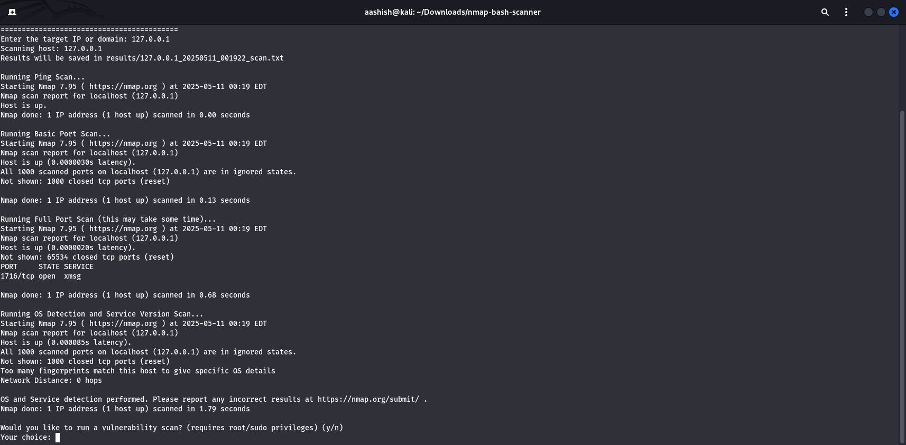

### 6. Scan Completion

All scans completed successfully:

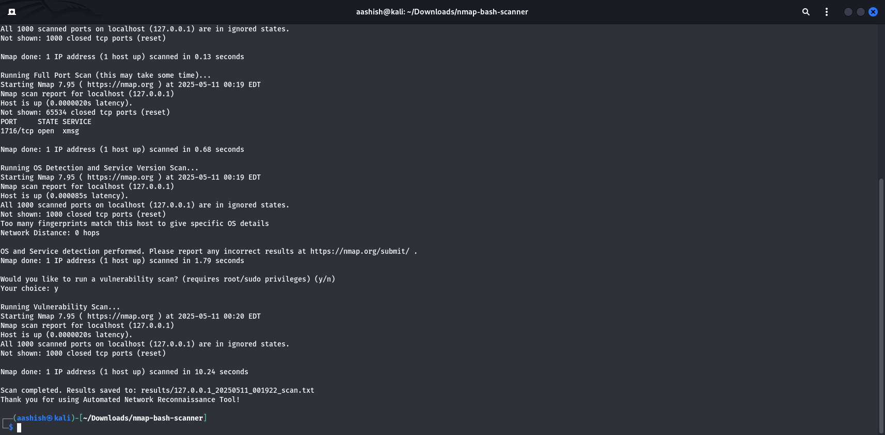

### 7. Viewing Results

The results are saved to a file in the results directory and can be viewed:

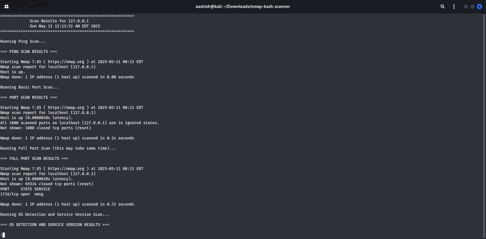

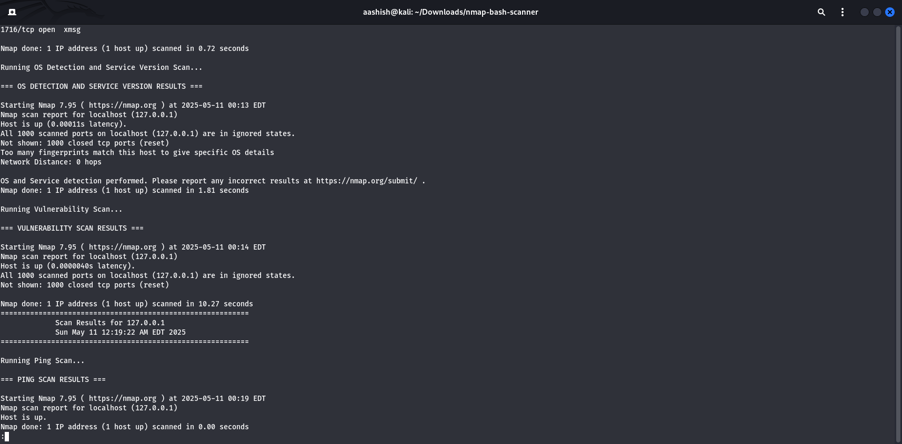

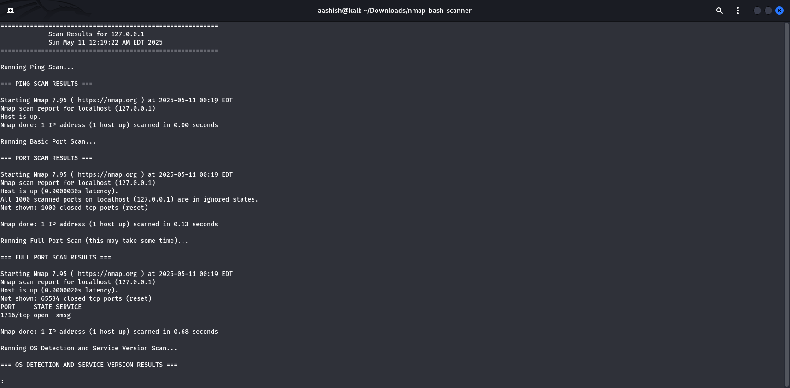

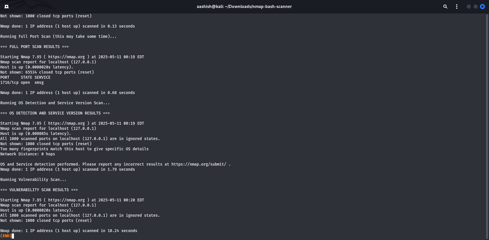

## Sample Scan Results

A complete sample scan of localhost (127.0.0.1) is included in the results directory. This shows the kind of information the tool can collect from a target system.

## Warning and Legal Disclaimer

This tool is meant for educational purposes and authorized security testing only. Unauthorized scanning of networks is illegal in many jurisdictions and unethical. Always:

1. Only scan systems you own or have explicit permission to scan
2. Use this tool responsibly and ethically
3. Understand local laws regarding network scanning before use

The authors of this tool assume no liability for misuse or damage caused by this program.

## License

All rights reserved. This project does not have an open source license.

## Acknowledgments

- The Nmap Project (https://nmap.org)
- All open-source contributors who make tools like this possible
